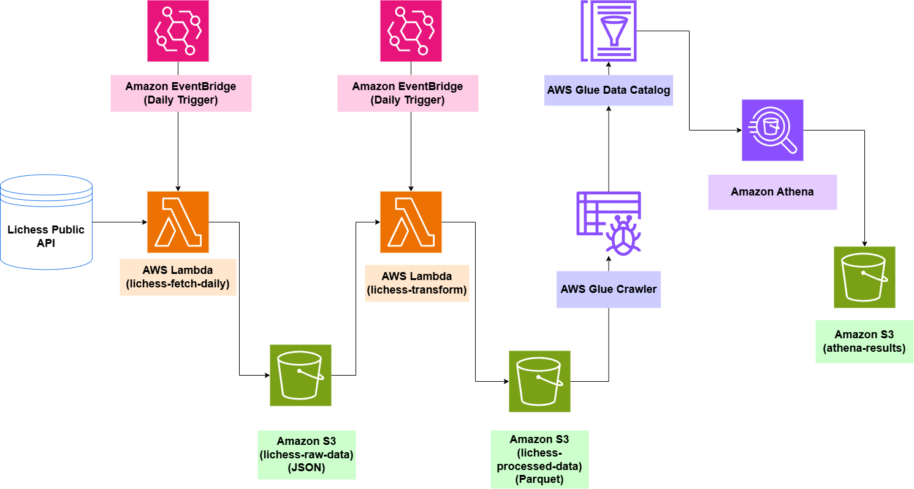

# Lichess Data Lake: Serverless Daily ETL Pipeline for Chess Performance Analytics

## Project Overview

A fully automated, serverless data pipeline that tracks daily rating changes of top Lichess players (blitz, rapid, bullet). The pipeline extracts data from the Lichess public API, stores raw JSON in Amazon S3, transforms it into partitioned Parquet using AWS Lambda, catalogs the data with AWS Glue, and enables SQL analytics via Amazon Athena. This project demonstrates modern data engineering practices on AWS, all within the Free Tier.

**Key Features:**
- Daily incremental ingestion from Lichess API
- Raw and processed storage layers in S3
- Serverless transformation with AWS Lambda + AWS Wrangler
- Data cataloging using AWS Glue
- Interactive querying with Amazon Athena
- Cost‑efficient – designed to run within AWS Free Tier

---

## Architecture

<p align="center">
  
</p>

1. **Amazon EventBridge** triggers a daily Lambda function at 00:05 UTC.
2. **Lambda (fetch-leaderboard)** calls the Lichess API for top 100 players in blitz, rapid, and bullet, and stores raw JSON in the **raw S3 bucket** under `raw/leaderboard/YYYY-MM-DD/`.
3. An **S3 event** triggers another Lambda function (**transform-to-parquet**), which:
   - Reads the JSON
   - Transforms it into a DataFrame
   - Writes it as **partitioned Parquet** to the **processed S3 bucket** (`leaderboard/performance=.../snapshot_date=.../`)
4. **AWS Glue Crawler** scans the processed bucket, updates the **Glue Data Catalog**, and makes the data queryable.
5. **Amazon Athena** runs SQL queries directly on the Parquet data, enabling analytics such as top gainers, volatility, and rating trends.

---

## AWS Services Used

| Service | Purpose |
|---------|---------|
| **Amazon S3** | Raw JSON and processed Parquet storage |
| **AWS Lambda** | Serverless compute for ingestion and transformation |
| **Amazon EventBridge** | Daily scheduling of the ingestion function |
| **AWS Glue** | Data cataloging (crawler) |
| **AWS Glue Data Catalog** | Metadata repository for Athena queries |
| **Amazon Athena** | Serverless SQL analytics |
| **AWS IAM** | Fine‑grained permissions for all services |
| **AWS Wrangler** | Efficient Parquet conversion and partitioning |
| **Amazon CloudWatch** | Logging and monitoring |

---

## Dataset

- **Source:** [Lichess Public API](https://lichess.org/api)
  - Leaderboard endpoint: `/api/player/top/100/{blitz,rapid,bullet}`
  - Data includes `username`, `rating`, `rank` (inferred), and `snapshot_date`
- **Time range:** 2026‑02‑08 to 2026‑02‑20 (13 days)
- **Fact table:** `leaderboard` – daily snapshots of top 100 players per mode (≈ 300 rows/day, 3,900 total)
- **Partitioning:** `performance` (blitz/rapid/bullet) and `snapshot_date` (YYYY‑MM‑DD) for efficient querying

---

## Pipeline Steps

### 1. Daily Ingestion
- **Trigger:** EventBridge rule `cron(5 0 * * ? *)` (00:05 UTC daily)
- **Lambda:** `lichess-fetch-daily` (Python 3.13)
- **Action:** Fetches top 100 for each mode, uploads JSON to `s3://[raw-bucket]/raw/leaderboard/YYYY-MM-DD/`

### 2. Transformation to Parquet
- **Trigger:** S3 event on raw bucket (prefix `raw/leaderboard/`, suffix `.json`)
- **Lambda:** `lichess-transform` (Python 3.13) with AWS Wrangler layer
- **Action:** Converts JSON to DataFrame, writes partitioned Parquet to `s3://[processed-bucket]/leaderboard/` using `partition_cols=['performance', 'snapshot_date']`

### 3. Data Cataloging
- **Glue Crawler:** `lichess-leaderboard-crawler`
- **Target:** `s3://[processed-bucket]/leaderboard/`
- **Output:** Table `leaderboard` in database `lichess_db` with partitions automatically registered

### 4. Analytics with Athena
- **Query result location:** `s3://[processed-bucket]/athena-results/`
- **SQL queries** (see examples below) run on the cataloged table.

---

## Analytical Queries (Examples)

Here are some of the insights you can derive from the data. All queries are saved in the `athena_queries/` folder.

### Volatility Ranking: Find players with the most fluctuating ratings - the 'high-risk, high-reward' players.

```sql
SELECT 
    username,
    ROUND(STDDEV(rating), 2) AS volatility,
    COUNT(*) AS days_tracked,
    MIN(rating) AS min_rating,
    MAX(rating) AS max_rating
FROM leaderboard
WHERE snapshot_date BETWEEN '2026-02-08' AND '2026-02-20'
GROUP BY username
HAVING COUNT(*) >= 5
ORDER BY volatility DESC
LIMIT 15;
```

**This shows the most volatile players in each performance category. Volatility (standard deviation) captures how much their rating jumps around.**

## Screenshots

The [docs/screenshots/](docs/screenshots/) folder contains visual proof of the working pipeline, including:

- S3 bucket structures (raw JSON folders, processed Parquet partitions)
- IAM roles, permissions, policices
- Lambda function configurations and triggers
- CloudWatch logs showing successful executions
- Glue crawler configuration and run history
- Athena query results for key analytics

## How to Deploy (For Reproducibility)

If you want to replicate this pipeline in your own AWS account:

### Prerequisites
- AWS account with appropriate permissions
- S3 buckets (raw and processed) – make sure you replace `[raw-bucket]` and `[processed-bucket]` with your actual raw and processed bucket names respectively, in the code
- IAM roles with the policies provided in `iam_policies/`

### Steps:
1. **Create S3 buckets** – e.g., `lichess-raw-data-<yourname>` and `lichess-processed-data-<yourname>`.
2. **Set up IAM roles** – attach the inline policies from `iam_policies/` to Lambda execution roles.
3. **Deploy Lambda functions** – use the code in `lambda_functions/`. Add the appropriate triggers (EventBridge for fetch, S3 event for transform) and environment variables (`RAW_BUCKET`, `PROCESSED_BUCKET`). For the transform function, attach the AWS‑provided Pandas layer (ARN for Python 3.13 in your region).
4. **Configure Glue Crawler** – point it to `s3://[processed-bucket]/leaderboard/`, output to a new database `lichess_db`. Use schema change policy “Add new columns only” and run on demand or schedule.
5. **Set Athena query result location** – to `s3://[processed-bucket]/athena-results/`.
6. **Run the backfill script** (optional) to populate historical data – provided in the project documentation.

## Lessons Learned & Future Improvements
- **Schema evolution:** The “Add new columns only” setting in the crawler ensures that future API changes (new fields) won't break existing data.
- **Partitioning:** By partitioning on performance and snapshot_date, Athena queries are fast and cost‑effective.
- **Cost awareness:** The entire pipeline runs within Free Tier – a great example of efficient cloud architecture.

- **Potential enhancements:**
	- Enrich data with player profiles (title, country, total games) from the Lichess user API.
	- Build a dashboard using Amazon QuickSight or a Python dashboard tool.
	- Add error notifications via SNS for pipeline failures.
	- Automate MSCK REPAIR TABLE after each new day's data to avoid crawler costs.

## Acknowledgements

- Lichess API for providing free, open chess data.
- AWS Free Tier for enabling cost‑free learning and experimentation.


